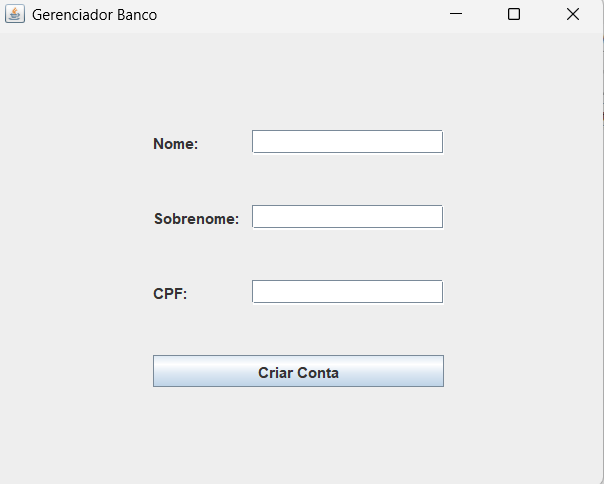
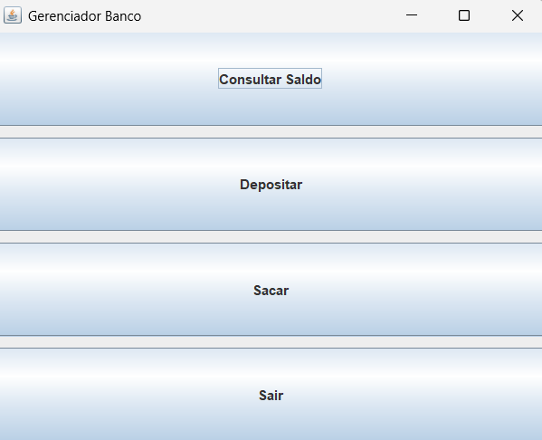

# Sistema Bancário Simples em Java com Interface Gráfica (Swing)

Um sistema bancário simples com interface gráfica construída com a biblioteca Swing, que permite a criação de contas, depósitos, saques e consultas de saldo.

## Funcionalidades

Este sistema bancário oferece as seguintes funcionalidades:

- **Criar Conta Bancária**: O usuário informa nome, sobrenome e CPF para criar uma conta.

- **Validação de Nome e Sobrenome**: O sistema valida que o nome e sobrenome contêm apenas letras. Caso contrário, será exibida uma mensagem de erro alertando que os campos devem ter somente letras.

- **Validação de CPF**: O CPF inserido deve conter exatamente 11 dígitos numéricos. Se o CPF for inválido, será exibida uma mensagem de erro indicando que o CPF deve conter exatamente 11 números.

- **Consultar Saldo**: Permite que o usuário consulte o saldo atual da sua conta bancária.

- **Depositar**: O usuário pode realizar depósitos informando um valor. O sistema aceita números com vírgulas ou pontos decimais.

- **Sacar**: O usuário pode realizar saques, com validação de saldo suficiente. Caso o valor do saque seja maior que o saldo, uma mensagem de erro será exibida informando sobre o saldo insuficiente, e o valor não será descontado da conta.

- **Sair**: Permite ao usuário encerrar a aplicação.


### Estrutura do Código
* Cliente: Classe que representa os dados pessoais (nome, sobrenome, CPF).

* ContaBancária: Classe que gerencia o saldo e as operações financeiras da conta bancária.

* Banco: Classe principal que cria a interface gráfica e gerencia a interação com o usuário.

#### Tecnologias Utilizadas

**Java 8** ou superior

**Swing**: Biblioteca de interface gráfica para Java.

**AWT (Abstract Window Toolkit)**: Utilizado para alguns componentes gráficos e manipulação de layout.

##### Como Executar o Programa:

1.Clone o Repositório:
```
git clone [URL_do_repositório]
```

2.Compile e Execute a Classe (Banco):

Use um ambiente de desenvolvimento Java, como NetBeans ou IntelliJ IDEA, ou compile e execute pelo terminal:
```
javac Banco.java
java Banco
```
A interface gráfica será exibida com a tela inicial de criação de conta.

**Tela Inicial**



Depois de criar a conta será exibida a tela para realização de operações bancárias.

**Tela de Operações**



